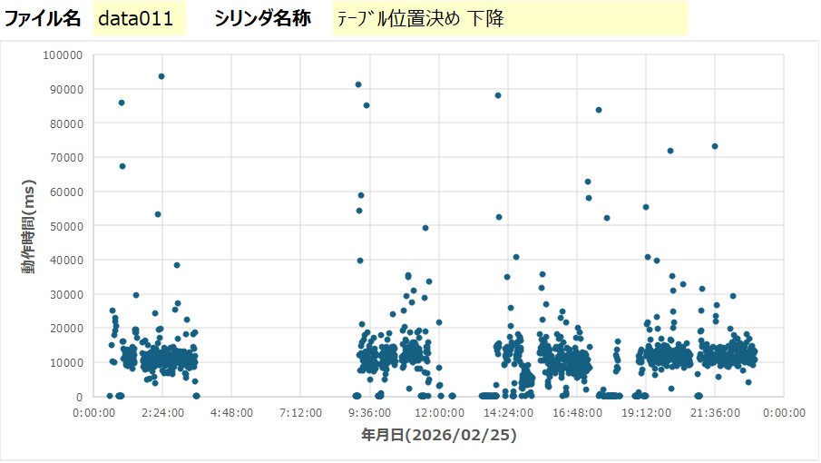
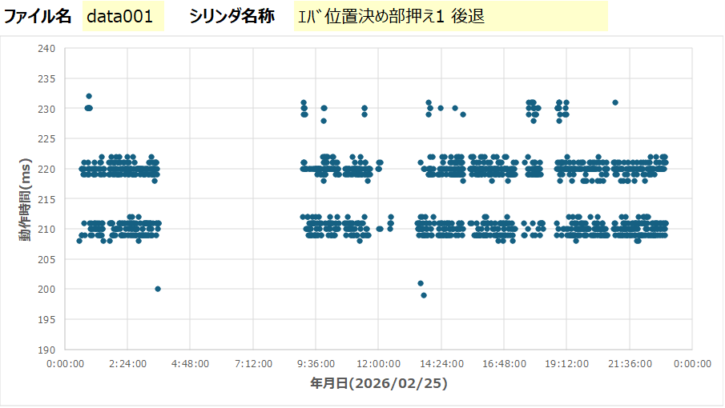
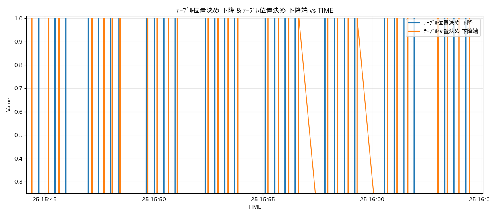
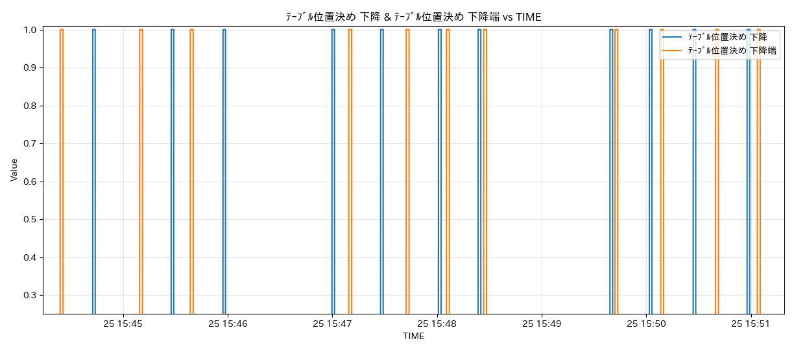
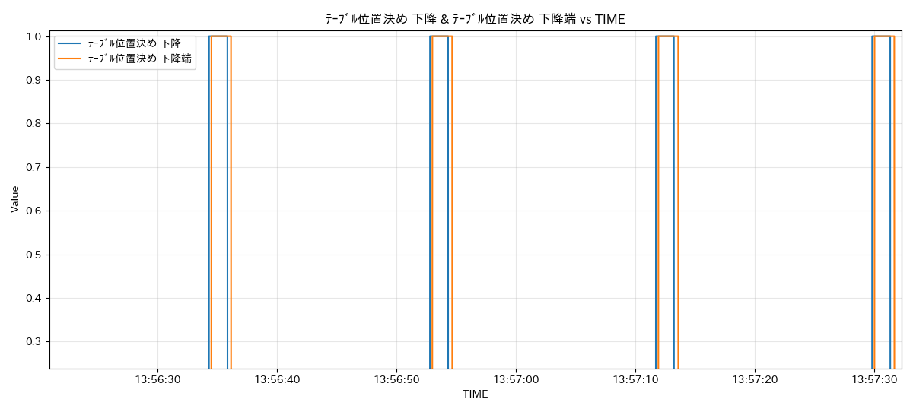
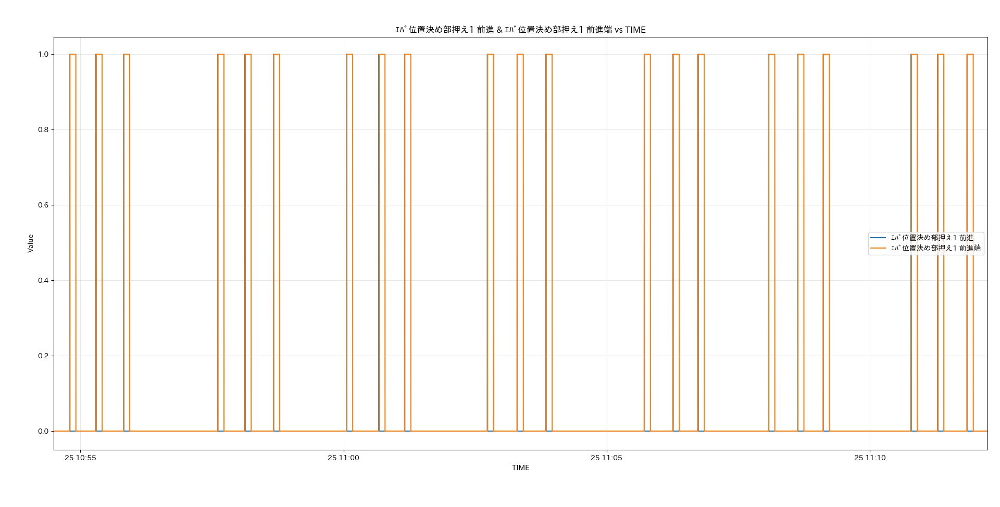
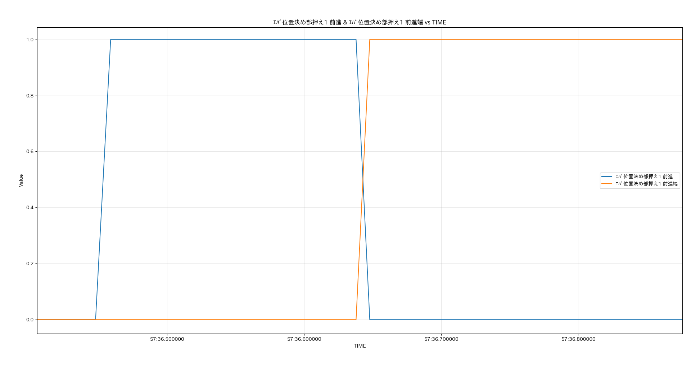

# 調査
### 時間データを確認

<table style = "outline:none;">
    <tr>
        <td> 
            <table>
            
DATA11_ﾃｰﾌﾞﾙ位置決め 下降

            <tr><th>TIME</th><th>Value (ms)</th></tr>
            <tr><td>2026/2/25 15:42</td><td>1489569</td></tr>
            <tr><td>2026/2/25 15:42</td><td>1500710</td></tr>
            <tr><td>2026/2/25 15:43</td><td>1496740</td></tr>
            <tr><td>2026/2/25 15:43</td><td>1493900</td></tr>
            <tr><td>2026/2/25 15:44</td><td>1487810</td></tr>
            <tr><td>2026/2/25 15:44</td><td>1486069</td></tr>
            <tr><td>2026/2/25 15:45</td><td>1468520</td></tr>
            <tr><td>2026/2/25 15:45</td><td>1469171</td></tr>
            <tr><td>2026/2/25 15:46</td><td>1465450</td></tr>
            <tr><td>2026/2/25 15:47</td><td>1468971</td></tr>
            <tr><td>2026/2/25 15:47</td><td>1472550</td></tr>
            <tr><td>2026/2/25 15:48</td><td>1465901</td></tr>
            <tr><td>2026/2/25 15:48</td><td>1474801</td></tr>
            <tr><td>2026/2/25 15:48</td><td>1483740</td></tr>
            <tr><td>2026/2/25 15:49</td><td>1497970</td></tr>
            <tr><td>2026/2/25 15:49</td><td>1507220</td></tr>
            <tr><td>2026/2/25 15:50</td><td>1517350</td></tr>
            <tr><td>2026/2/25 15:50</td><td>1517670</td></tr>
            <tr><td>2026/2/25 15:50</td><td>1518330</td></tr>
            <tr><td>2026/2/25 15:51</td><td>1519049</td></tr>
            </table>
        </td>
        <td>
            <table>
            
DATA01_ｴﾊﾞ位置決め部押え1 後退

            <tr><th>TIME</th><th>Value (ms)</th></tr>
            <tr><td>2026/2/25 15:42</td><td>220</td></tr>
            <tr><td>2026/2/25 15:43</td><td>219</td></tr>
            <tr><td>2026/2/25 15:43</td><td>220</td></tr>
            <tr><td>2026/2/25 15:44</td><td>211</td></tr>
            <tr><td>2026/2/25 15:45</td><td>221</td></tr>
            <tr><td>2026/2/25 15:45</td><td>209</td></tr>
            <tr><td>2026/2/25 15:46</td><td>209</td></tr>
            <tr><td>2026/2/25 15:46</td><td>219</td></tr>
            <tr><td>2026/2/25 15:47</td><td>209</td></tr>
            <tr><td>2026/2/25 15:47</td><td>220</td></tr>
            <tr><td>2026/2/25 15:48</td><td>210</td></tr>
            <tr><td>2026/2/25 15:48</td><td>210</td></tr>
            <tr><td>2026/2/25 15:48</td><td>220</td></tr>
            <tr><td>2026/2/25 15:49</td><td>219</td></tr>
            <tr><td>2026/2/25 15:49</td><td>219</td></tr>
            <tr><td>2026/2/25 15:50</td><td>209</td></tr>
            <tr><td>2026/2/25 15:50</td><td>221</td></tr>
            <tr><td>2026/2/25 15:51</td><td>219</td></tr>
            <tr><td>2026/2/25 15:51</td><td>209</td></tr>
            <tr><td>2026/2/25 15:52</td><td>220</td></tr>
            </table>
        </td>
    </tr>
</table>

###　グラフで確認

### 生データをグラフで確認

DATA11_ﾃｰﾌﾞﾙ位置決め 下降

⇒下降の指示(0, 1)と、下降端の指示(0, 1)がなんとなくイメージと乖離する

全体がずれているわけでもなく、うまく重なっているところもある

  

DATA02_ｴﾊﾞ位置決め部押え1 前進

⇒イメージ通り。前進が入って、前進端がONしたと同時に、前進の自己保持が切れる

## 書き方参考
>[Markdown記法一覧](https://qiita.com/oreo/items/82183bfbaac69971917f "Markdown記法一覧")